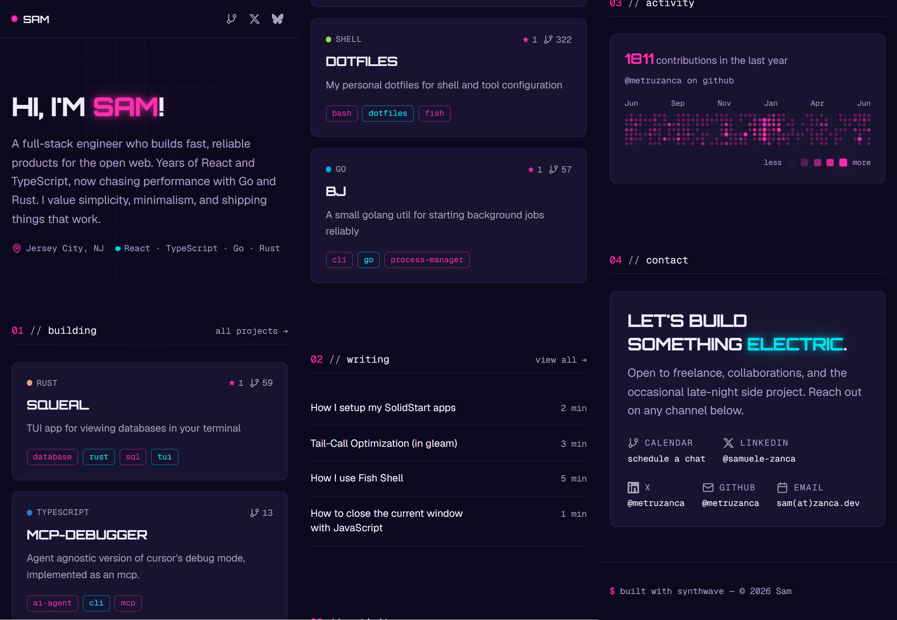

# metru.dev



Personal porfolio built with [Dioxus 0.7](https://dioxuslabs.com) and with a Synthwave inspired design-system with Geist + Orbitron fonts and dark-only color scheme.

## How it works

The site is a **Dioxus fullstack** app — Rust on both client and server. At build time:

- **Blog posts** are read from `blog/*.md`, code-generated into Rust constants via `build.rs`, and rendered with syntax-highlighted MDX.
- **GitHub data** (pinned repos, all public repos, contribution graph) is fetched from the GitHub GraphQL API using `octocrab` and baked into the binary. Requires a `GITHUB_TOKEN` at build time.

At runtime the server renders pages via Dioxus SSR and hydrates them on the client.

## Hosting

Built into a single static binary via `dx bundle --web --release` and deployed as a Docker container on [Railway](https://railway.app). The `Dockerfile` uses `cargo-chef` for cached dependency builds and bundles the server + assets into a slim runtime image.

## Development

```bash
# Dioxus-CLI
dx serve
```
